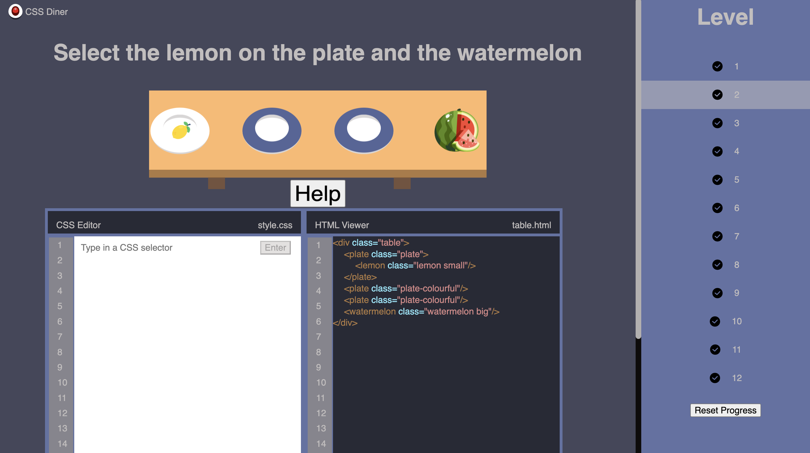

# CSS-selector

## 📝 Description

This interactive web application allows users to test their CSS selector skills by entering selectors that match specific highlighted elements in the provided HTML structure. The goal is to correctly identify and target the elements with CSS selectors.

## 🛠️ Technology Stack

- JS
- HTML
- CSS
- TypeScript 
- ESLint 
- Jest 

## 📜 Available Scripts

In the project directory, you can run:

### `npm start` ▶️

Runs the app in the deployment  mode.\
Open [https://celebrated-bienenstitch-6735e8.netlify.app/](https://celebrated-bienenstitch-6735e8.netlify.app/) to view it in the browser.

The page will reload if you make edits.\
You will also see any lint errors in the console.

### `npm test` 🧪

Launches the test runner in the interactive watch mode.\
See the section about [running tests](https://facebook.github.io/create-react-app/docs/running-tests) for more information.

### `npm run build` 🏗️

Builds the app for production to the `build` folder.\
It correctly bundles React in production mode and optimizes the build for the best performance.

### `npm run lint` 🔍

Runs ESLint to analyze and identify lint errors in the codebase.

## 🚀 Getting Started

To set up and run the project locally, follow these steps:

1. Clone the repository: `git clone git@github.com:papryca/CSS-selector.git`
2. Navigate to the project directory: `cd css-selector`
3. Install dependencies: `npm install`
4. Start the development server: `npm start`

The application will open in your default browser, allowing you to explore and interact with it.

### `Screenshot`

